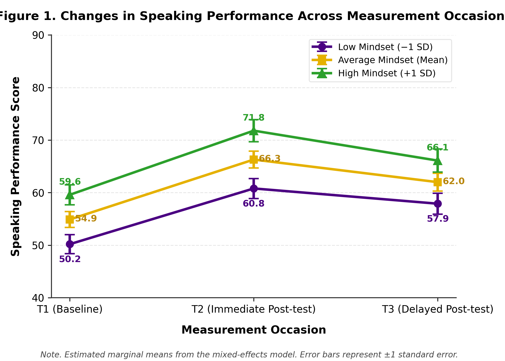
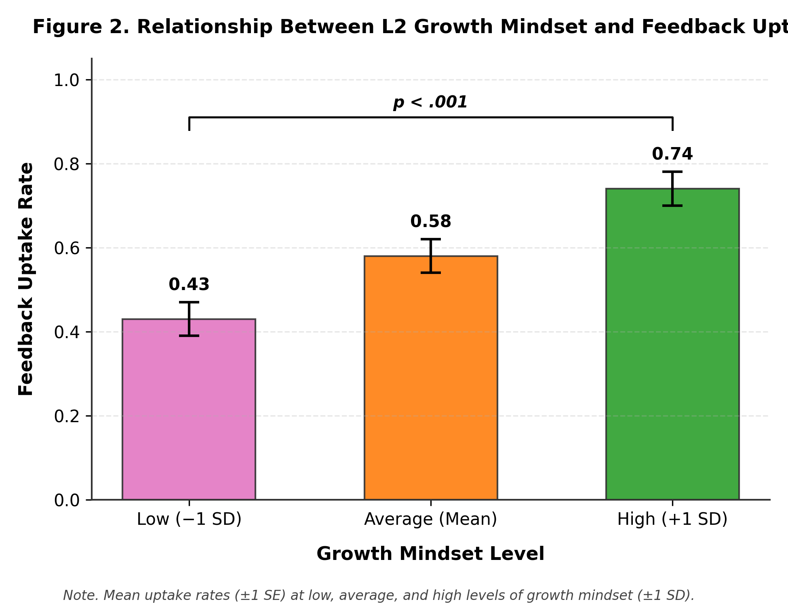
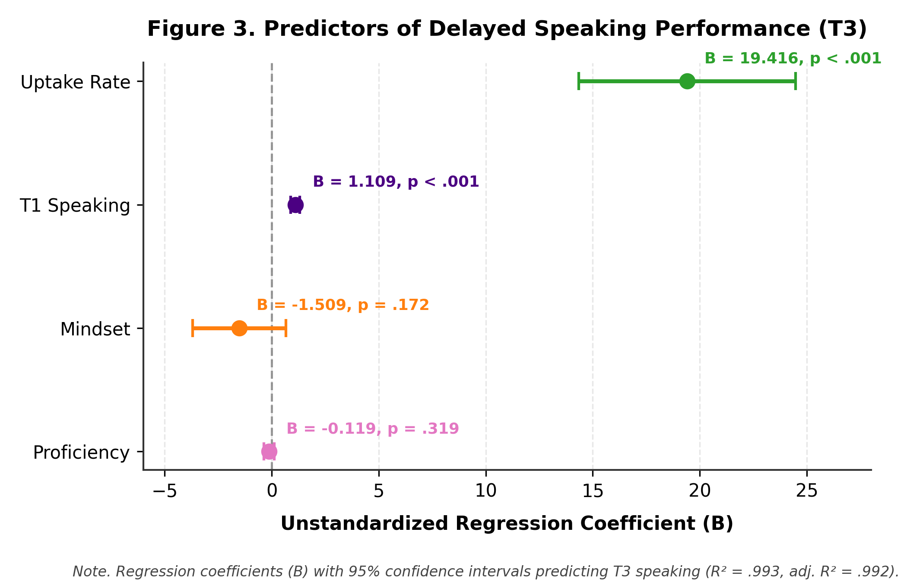
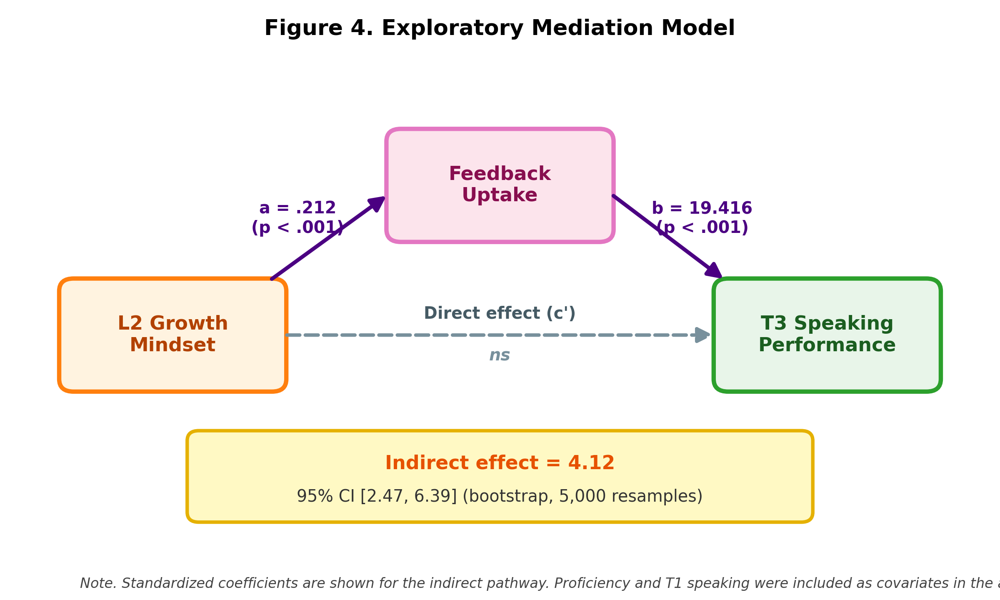

# From Feedback to Fluency: How L2 Growth Mindset Shapes Corrective Feedback Uptake and Speaking Development

[]() [-green)]() []()

Repository of the study *"From Feedback to Fluency: How L2 Growth Mindset Shapes Corrective Feedback Uptake and Speaking Development"* — a longitudinal quantitative study of **120 English learners** linking L2 growth mindset, oral corrective feedback (OCF) uptake, and speaking performance across three measurement occasions.

**Keywords:** L2 growth mindset · oral corrective feedback · feedback uptake · speaking development · learner beliefs · longitudinal research

---

## 🖼️ Graphical Abstract & Key Figures

<p align="center">
  
  <br><em>Graphical abstract: L2 growth mindset → feedback uptake → speaking development.</em>
</p>


### Analysis Figures

| Figure | Description |
|---|---|
|  | **Fig. 1.** Speaking performance trajectories across T1 → T2 → T3 (N = 120). Means rose from 54.93 (SD = 5.10) at T1 to 66.28 (SD = 6.69) at T2 and remained above baseline at T3 (62.02, SD = 7.09); *F*(2, 238) = 2981.83, *p* < .001, ηp² = .962. |
|  | **Fig. 2.** Association between L2 growth mindset and feedback uptake (r = .990, *p* < .001). |
|  | **Fig. 3.** Regression of delayed speaking performance on mindset, uptake, and baseline proficiency (uptake: B = 19.416, *p* < .001, controlling for T1 speaking, mindset, and proficiency). |
|  | **Fig. 4.** Exploratory bootstrap mediation model: indirect effect of mindset on delayed speaking via uptake = 4.12, 95% CI [2.47, 6.39]. |

---

## 📊 Key Results

| Measure | Result |
|---|---|
| Repeated-measures effect of Time | *F*(2, 238) = 2981.83, *p* < .001, ηp² = .962 |
| T1 → T2 gain | 54.93 → 66.28 (t = −69.99, p < .001, d ≈ 1.91) |
| T2 → T3 change | 66.28 → 62.02 (t = 74.23, p < .001) — partial loss, still above T1 |
| T1 → T3 net gain | 54.93 → 62.02 (t = −37.08, p < .001, d ≈ 1.15) |
| Mindset ↔ uptake | r = .990, p < .001 |
| Mindset-by-Time interactions | T2: B = 2.550; T3: B = 3.225 (both p < .001) |
| Uptake → delayed speaking | B = 19.416, p < .001 (controlled for baseline, mindset, proficiency) |
| Mediation (indirect effect) | 4.12, bootstrap 95% CI [2.47, 6.39] |
| Multicollinearity check | Very high intercorrelations (r = .98–.99) and large VIFs — severe multicollinearity |

### Descriptive statistics (N = 120)

| Variable | Mean | SD | Min | Max |
|---|---|---|---|---|
| Proficiency | 64.93 | 5.99 | 52 | 75 |
| Mindset (1–5) | 3.49 | 0.61 | 2.2 | 4.6 |
| T1 Speaking | 54.93 | 5.10 | 45 | 64 |
| T2 Speaking | 66.28 | 6.68 | 54 | 79 |
| T3 Speaking | 62.02 | 7.09 | 48 | 75 |
| Feedback uptake rate | 0.58 | 0.16 | 0.25 | 0.90 |

---

## ✅ Conclusion

Speaking performance changed significantly across the three occasions, with a large immediate gain after the feedback period (T1 → T2) and a partial decline that nonetheless remained well above baseline at delayed post-test (T3). Growth mindset was strongly associated with feedback uptake, and uptake significantly predicted delayed speaking performance even after controlling for baseline speaking, mindset, and proficiency; mindset-by-time interactions confirmed that higher-mindset learners showed steeper gains. An exploratory bootstrap mediation supported uptake as a behavioral link between mindset and speaking development (indirect effect = 4.12, 95% CI [2.47, 6.39]).

**However**, the exceptionally high intercorrelations among mindset, proficiency, uptake, and speaking scores (r ≈ .98–.99) and large VIF values indicate severe multicollinearity. The findings therefore support a strong statistical association among learner mindset, feedback engagement, and speaking development, while cautioning **against** interpreting these relationships as evidence of independent causal mechanisms. Replication with more discriminating measures and independent samples is needed. Practically, the study highlights feedback uptake as a potentially important behavioral bridge between learner beliefs and long-term L2 speaking performance.

---

## 📁 Repository Contents

- `github_scripts/` — Python & R analysis scripts (descriptives/correlations, repeated measures, mixed models, regression/VIF, bootstrap mediation, figures)
- `Figures/` — High-resolution figures and graphical abstract
- `01_Data_Overview.ipynb` … `05_Correlation_and_Regression.ipynb` — step-by-step notebooks
- `Longitudinal_Data_120.csv`, `Mindset_Raw_Data_120.csv` — datasets
- `Longitudinal_Study_Complete_Data.json`, `Longitudinal_Analysis_Results.json` — full data & numeric results
- `Longitudinal_Data_120_Analysis.xlsx`, `Mindset_English_Subscales_Statistics.xlsx` — Excel outputs
- `Longitudinal_Analysis_Report_FA.md` — full statistical report (Persian)
- `main doc.docx` — full manuscript

### Quick start
```bash
pip install pandas numpy scipy statsmodels matplotlib seaborn
python github_scripts/python/01_descriptive_and_correlations.py
